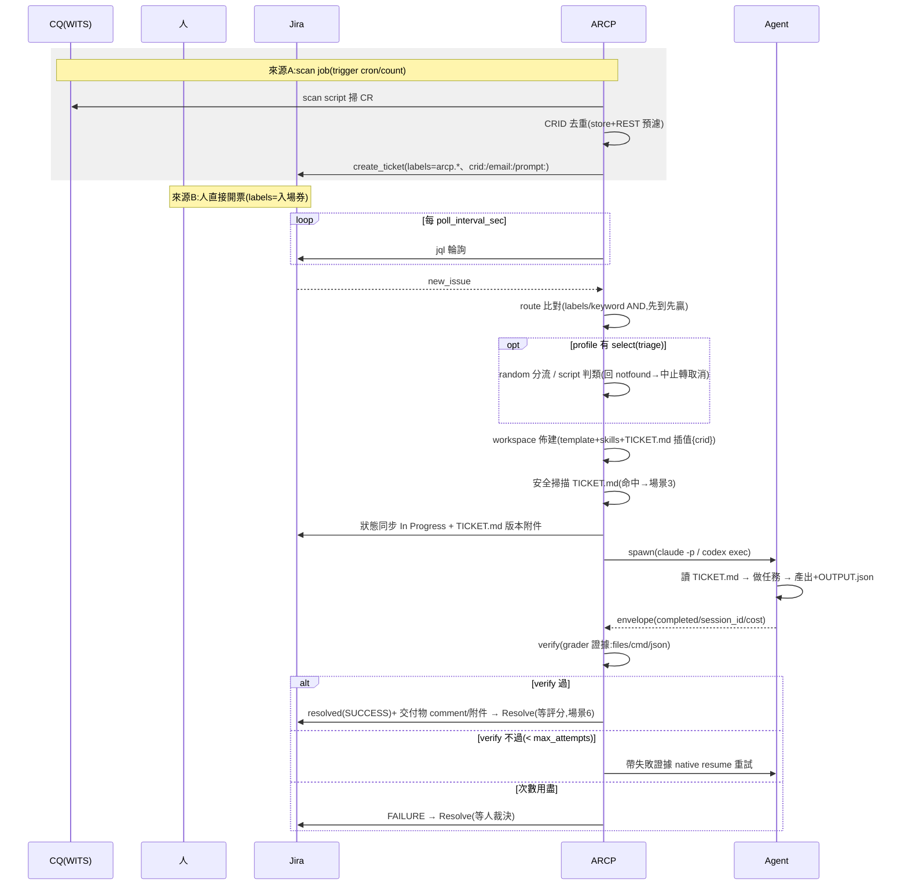
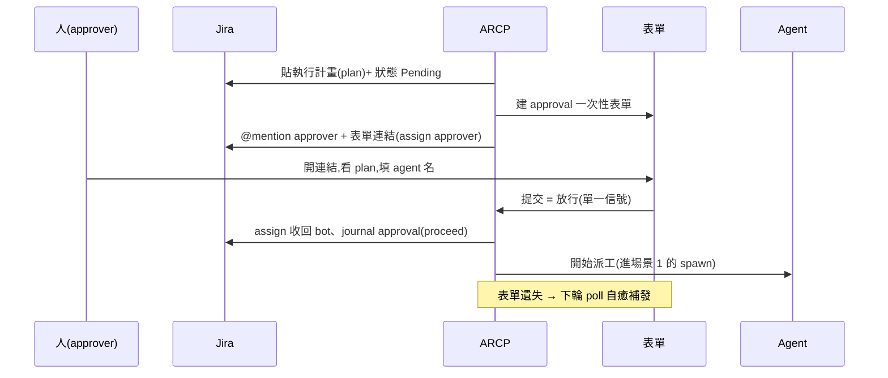
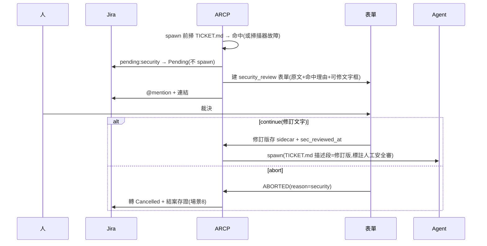
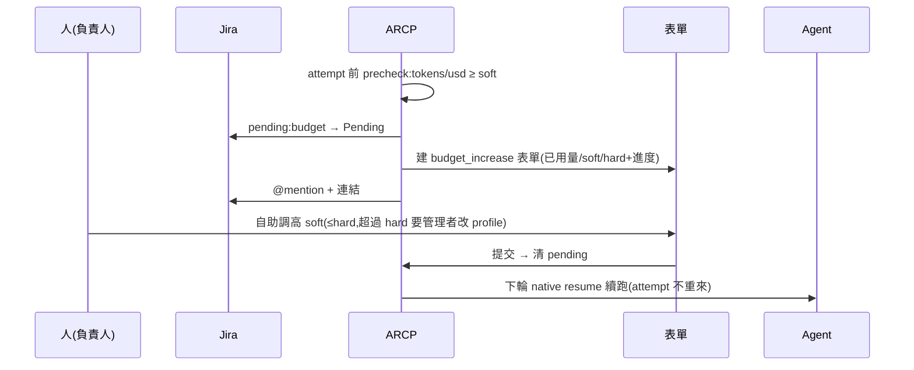
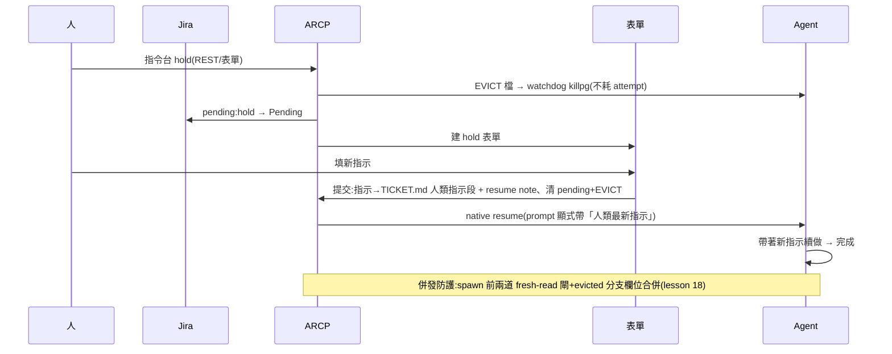
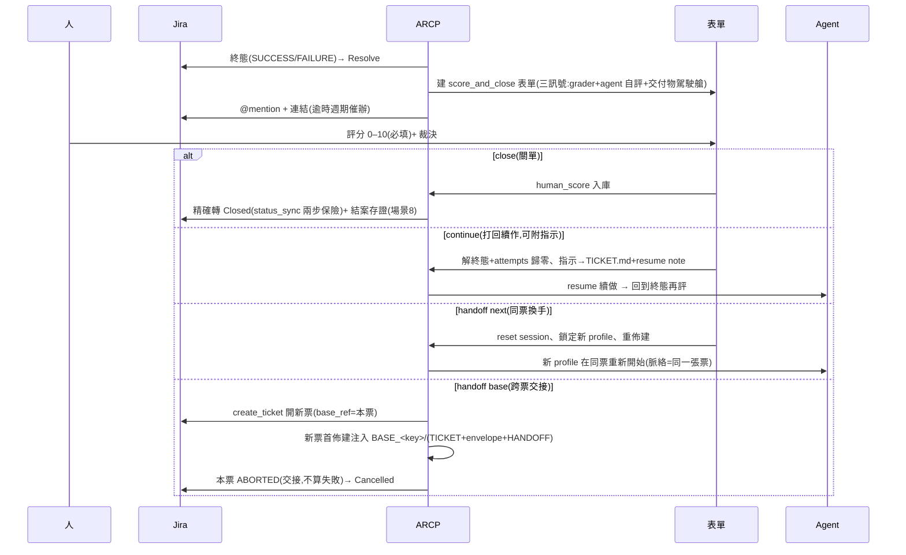
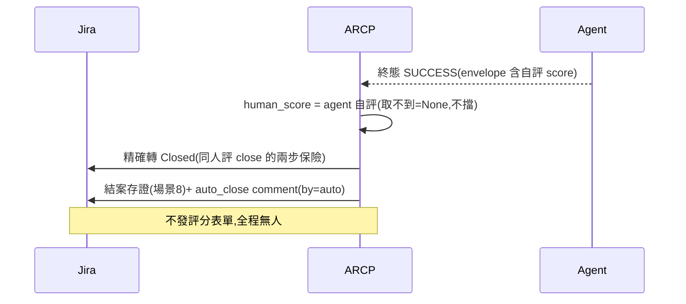
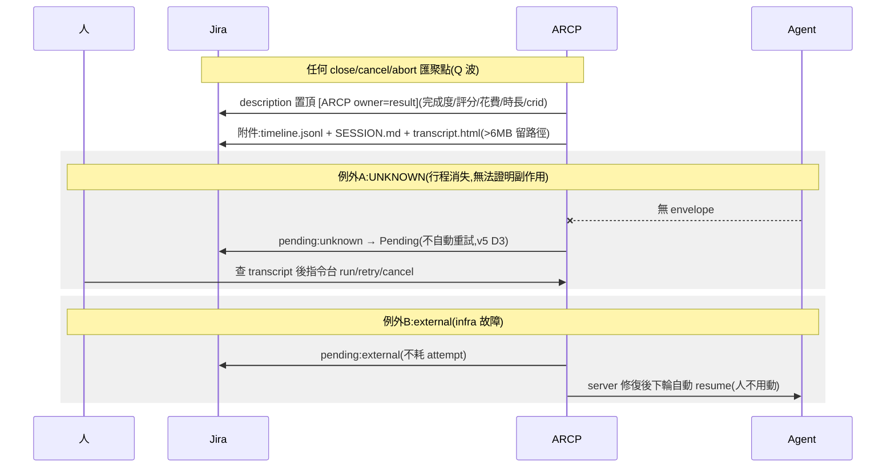
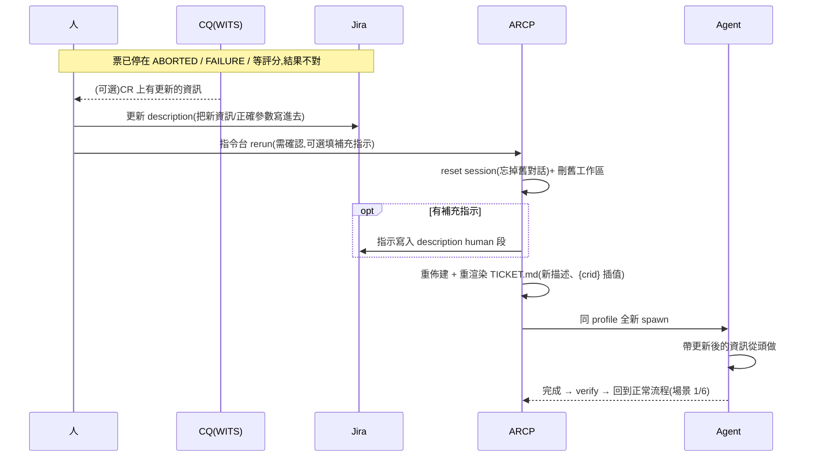

# Sequence Charts — 開票與全部 HIL 場景(角色統一)

> 所有圖用**同一組角色**(Mermaid;GitHub/內網支援 mermaid 的 viewer 直接渲染,
> 純文字也可讀)。事件名 = journal 事件([observability](observability.md)),
> 可直接對照 dashboard 時間軸。Block diagram 見 [architecture](architecture.md),
> 狀態機見 web `/concepts`。

**角色(全篇一致)**:

| 角色 | 說明 |
|---|---|
| `H` 人 | 負責人/管理者(開票、填表單、下指令) |
| `CQ` WITS/CQ | 外部 issue 系統(CR 編號) |
| `J` Jira | 票=人機溝通紀錄(狀態同步/留言/附件) |
| `P` ARCP | poller+dispatcher(輪詢、路由、派工、驗收、回寫) |
| `F` 表單 | 一次性 token 表單服務(HIL 人機介面) |
| `A` Agent | headless CLI(`claude -p` / `codex exec`,只讀 workspace) |

---

## 1. 主流程:scan 開票 → route/triage → 派工 → 驗收 → 等評分

## 2. HIL:審批門(approval;`require_approval`)

## 3. HIL:安全審(security;TICKET.md 掃描命中,fail-closed)

## 4. HIL:budget 增額(單票 soft 上限破)

## 5. HIL:hold 中斷改方向(人主動)

## 6. HIL(End):評分與三種裁決(close / continue / handoff)

## 7. auto_close(無人值守;`auto_close: on_success|all`)

## 8. 收尾共通:結案存證 + 例外(unknown / external)

## 9. rerun:資訊更新後同票乾淨重跑(含 ABORTED 復活)

與相鄰路徑分工:`retry`=同 session resume(帶舊對話)、HIL(End)
`continue`=打回+指示(帶舊對話)、`next`=換 profile、
**`rerun`=不換人但砍掉重練(ABORTED 唯一復活路)**。

---

**對照**:HIL 全表(reason×處理)= [interaction §3.2](interaction.md);
狀態推導 = [architecture §3](architecture.md);TICKET.md 資訊流 =
[workspace](workspace.md);結案存證 = [provenance](provenance.md)。
