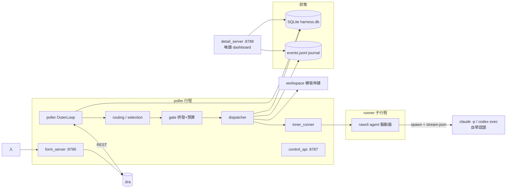
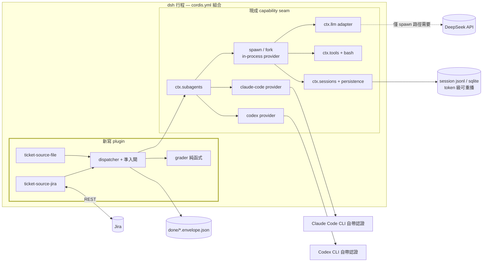
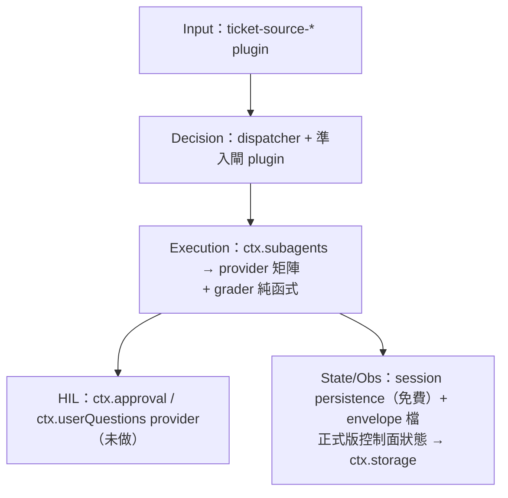
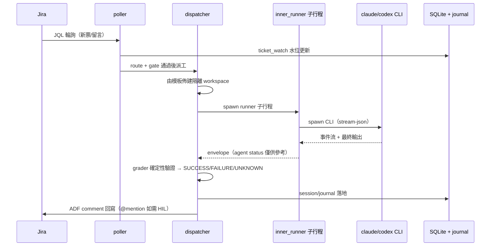
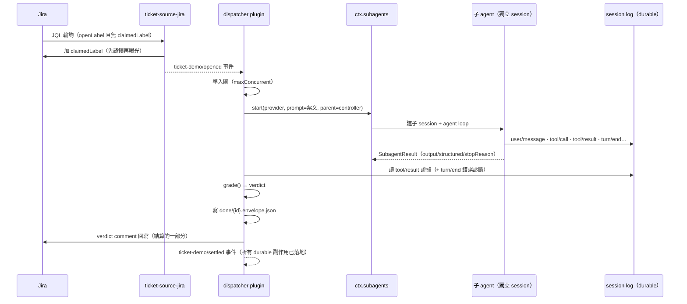

# ARCP 移植為 deepseek-harness plugin 的可行性評估與 PoC 實證

日期：2026-08-16。狀態：PoC 已實證通過（含真 Jira 端到端）。相關比較：[trajectory 視覺化比較](2026-08-trajectory-viz-comparison.md)。

## 問題

ARCP（約 9k 行純 Python）能否「純做成幾個插件」落地在 deepseek-harness（dsh，TypeScript、Cordis meta-framework、everything-is-a-plugin）上？本文回答三件事：子系統逐一對應到哪個 dsh 機制、哪裡是真正的缺口、以及一個最小 PoC 的實測結果。

## 結論（TL;DR）

**可行，且對應性比預期好。** ARCP 最重的部分（多 backend 執行、native resume、session 軌跡、隔離）在 dsh 幾乎都是現成 seam；真正要新寫的是 Jira 整合、確定性 grader、預算閘與 fleet 控制面；最大缺口是 dashboard/KPI 畫面。PoC（3 個核心模組 + 1 個可執行組合，約 700 行 TS 含測試）已實證：daemon 以 plugin 存活於 session 之上、經 `ctx.subagents` 派工、由 durable session 事件評分、真 Jira 認領與回寫，全部一次通過。

## 子系統對應表

| ARCP 子系統 | dsh 對應機制 | 評級 |
|---|---|---|
| jira_source + poller（外層迴圈） | 新 capability seam（PoC 中為 ticket source plugin）；effect-owned timer 常駐 plugin（`packages/schedule` 模式）。不是 `ctx.jobs`（那是 per-agent 背景工作） | 自然新 plugin |
| dispatcher + 3 backend × 2 engine | **大部分免費**：`ctx.subagents` 已有 `subagent-claude-code`（官方 SDK、native resume）、`subagent-codex`（app-server）、`subagent-acp`、`spawn/fork-in-process` provider；`SubagentResult`（output/structured/stopReason）即 `contract.py` envelope 的型別化版。821 行的 dispatcher.py 縮成薄 orchestrator（PoC 中約 140 行） | 現成 + 薄 plugin |
| grader / 證據型停止 | 純函式 + plugin：從 `outputSchema` 驗證過的 structured 輸出與 durable 的 `tool/result` session 事件折算 verdict——比抓 stream-json 更強 | 新 plugin（ARCP 獨有價值） |
| gate.py 預算/併發（6 層） | 新 plugin，計數器放 `ctx.storage`（sqlite），吃 `subagent/end` usage；dsh 沒有 fleet-wide 準入前例，屬新領域但無架構阻礙 | 新 plugin（新領域） |
| HIL 表單 + @mention + 命令台 | 決策 seam 對應 `ctx.approval`（waterfall）/`ctx.userQuestions`；表單/mention 是 provider 傳輸層；fleet 命令（hold/evict/rerun）需在 `packages/api`/sdk 新定義 RPC 面 | 新 plugin，命令台稍彆扭 |
| workspace.py 佈建/隔離 | ~100 行 provisioner plugin + 子 agent `cwd`；換得 `ctx.sandbox`/`ctx.fs` policy + per-agent preset（比 seatbelt wrapper 更強） | 小 plugin + 免費升級 |
| store.py + 54 事件 journal | 軌跡/transcript 免費（session events + `sessionPersistence` jsonl/sqlite + projections）；控制面狀態（ticket_watch/ticket_session/interactions）必須放 `ctx.storage`——dsh 的「model-visible ⟺ logged」invariant 禁止塞進 session log。journal 一分為二是健康的重新切分 | 現成 + 新 plugin |
| control_api + dashboard | 控制 RPC → `packages/api`（Typert）或 sdk JSON-RPC；session 時間軸/transcript 免費；**KPI/fleet 畫面是最大新工作**。過渡方案：ARCP 唯讀 dashboard 讀 dsh 持久化資料 | 最大缺口 |
| handoff（next/base） | `ctx.agents.resume()` / continuable subagent / `subagent-fork-in-process`——語意比 ARCP 豐富 | 現成 |

## Component 圖對照

ARCP 現況（三個行程 + 子行程；模組細節見 [architecture.md](../design/architecture.md)）：

plugin 化後（單一 dsh 行程，`cordis.yml` 宣告組合；粗框為本次新寫的部分）：

關鍵拓撲差異：ARCP 的 poller/control_api/form_server 同行程共生（為了 `hold` 能 killpg）與獨立 dashboard 行程，在 dsh 裡收斂為單一組合行程——驅逐改由 `SubagentRun.dispose()`／subprocess 行程樹 seam 承擔，不再依賴行程共生；dashboard 對應的資料（session 軌跡）由 persistence seam 自然產生，唯讀展示可以留在行程外。

## Layer 圖對照

ARCP 五層各自落到 dsh 的什麼位置（★ = 本次 PoC 已實作）：

| ARCP 層 | ARCP 模組 | dsh 落點 | 性質 |
|---|---|---|---|
| Input | jira_source · triggers | ticket-source-jira ★ / ticket-source-file ★（未來：`ctx.ticketSources` seam） | 新寫 |
| Decision | poller · routing · gate | dispatcher plugin ★（準入閘 ★ 為 6 層預算的佔位；正式版計數器放 `ctx.storage`） | 新寫 |
| Execution | dispatcher · inner_runner · workspace · contract · grader | `ctx.subagents` + 現成 providers（envelope = 型別化 `SubagentResult`）；grader ★ 純函式；workspace → `ctx.sandbox`/`ctx.fs` + 子 agent `cwd` | 大半現成 |
| HIL | interaction · hil · form_server · approval · commands | `ctx.approval`（waterfall）/`ctx.userQuestions` 的新 provider；fleet 命令需新 RPC 面 | 新寫（seam 現成） |
| State/Obs/Ctrl | store · journal · control_api · detail_server · kpi | 軌跡：session events + persistence + projections（免費）；控制面狀態：`ctx.storage`；控制 RPC：`packages/api`/sdk；KPI 畫面：全新 | 混合 |

## Data Flow 圖對照

ARCP 原本的一張票（簡化；完整時序見 [sequences.md](../design/sequences.md)）：

plugin 化後的一張票（PoC 實測路徑）：

資料流的實質差異：

- **證據通道**：ARCP 從 CLI 的 stream-json 即時解析；dsh 版直接讀 durable 的 session 事件（`tool/result`、`turn/end`），評分與診斷都是「事後可重播」的——PoC 中子代理模型 401 失敗時，envelope 能從 `turn/end` 帶回確切錯誤訊息，正是這條通道的展示。
- **認領機制**：ARCP 用 comment 水位 + SQLite `ticket_watch`；PoC 用 label + 檔案 rename（正式版需補水位持久化）。
- **envelope**：ARCP 是自定 JSON 契約（`contract.py`，跨 backend 手工統一）；dsh 版是 seam 型別化的 `SubagentResult`，`outputSchema` 還能讓 provider 端先驗證結構化結果。
- **事件順序保證**：dsh 版把 Jira 回寫收進結算，`ticket-demo/settled` 是「所有 durable 副作用完成」的訊號；ARCP 的 journal 事件與 Jira 回寫之間沒有這種單點承諾。

## Plugin 化的優點、缺點、與「哪裡需要」

**優點（PoC 中實際受益的）**：

- **seam 替換**：執行單元換 provider 是 cordis.yml 一行（`provider: spawn` → `claude-code`/`codex`/`acp`），ARCP 為此寫了三套 backend + 統一 envelope；型別契約由 seam 擁有。
- **宣告式組合與覆蓋**：`cordis.yml` + include/patch/profile 分層，測試 fixture 就是「同組合 + 兩行 patch 換 mock 模型」，keyless 冒煙因此免費。
- **effect 生命週期**：輪詢 timer、事件監聽、dispatcher 都是可逆 effect，unload/HMR 自動收乾——ARCP 的 graceful shutdown/hot reload 是自己寫的一套。
- **durable session 生態**：token 級重播、fork、投影、keyless replay 測試，全部隨 persistence seam 而來；ARCP 的 transcript/trajectory 工具鏈是自建的。
- **每票隔離升級路徑**：`ctx.sandbox`/`ctx.fs` policy 與 per-agent preset，比 ARCP 的 seatbelt wrapper 粒度細。

**缺點（誠實面）**：

- **框架綁定與學習曲線**：inject/effect/scope/waterfall 的心智模型、function-plugin vs Service class 的匯出規則（弄錯 Loader 會靜默丟棄 namespace）。
- **品質閘成本**：per-file 100% 覆蓋、invariant 伴生、雙語 README + Model Experience 段、Agent Note、REAL-composition 測試——同樣功能的 in-tree 成本是 Python 模組的數倍。
- **除錯多一層**：錯誤穿過 fiber/seam 時預設會丟細節（`SubagentResult` 不帶失敗訊息，PoC 需自己從 session log 撈回）；行程內單體的 stack trace 反而直接。
- **控制面 daemon 沒鋪路**：dsh 是 agent 中心，poller 這類「session 之上的常駐者」得自己定型；fleet 級（跨 session）的閘與命令面沒有前例 seam。
- **兩種語言兩個生態**：Python 端資產（測試、debug 工具、SRS 對應）不可直接沿用。

**哪裡需要 plugin 化（值得投資）**：ticket source（Jira/ClearQuest/檔案多來源可插拔）、execution backend（已是 seam，最大紅利）、HIL provider（表單/mention 只是 `ctx.approval` 的一種傳輸）、budget gate（要吃 `subagent/end` usage 事件，天然是 plugin）。
**哪裡不需要**：grader 核心（純函式即可，plugin 只是掛載點）、KPI/dashboard（唯讀投影，可留在行程外、甚至沿用 ARCP 的 Python dashboard 讀 dsh 持久化資料）、workspace 模板複製（百行工具函式）。

## 還需要大語言模型 API 嗎？

**ARCP 現況：控制平面完全不需要 LLM API**——`claude -p`/`codex exec` 自帶訂閱與認證，ARCP 只 spawn CLI。

**plugin 化後：由 execution provider 決定，API 是可選項不是必需**：

| provider | 執行單元 | 需要 LLM API key？ | 對應 ARCP |
|---|---|---|---|
| `claude-code` | 真 Claude Code（官方 SDK，native resume） | 否（CLI 自帶認證） | rawcli × claude |
| `codex` | 真 Codex app-server | 否（CLI 自帶認證） | rawcli × codex |
| `acp` | 任一 ACP agent（如 OpenHands） | 否（對端自理） | openhands-acp |
| `spawn` / `fork` | dsh 自己的 in-process agent loop | **是**（`ctx.llm` adapter，如 DEEPSEEK_API_KEY） | （ARCP 沒有對應物） |

也就是說：**沿用 ARCP 的使用型態（claude-code/codex provider）依然零 API key**，與現況等價。`spawn` 是 dsh 多給的第四種選擇，付出 API key 換到的是：

- **子代理跑在 dsh 自己的 loop 裡**：完整 durable session log（model-visible ⟺ logged、token 級重播）、工具管線政策（pre-execute waterfall、guard、timeout）、`outputSchema` 結構化結果驗證、compaction、per-ticket sandbox/preset——CLI 黑盒路徑只拿得到最終輸出與 CLI 自己的 log。
- **模型自由**：DeepSeek 或任一 adapter，模型/成本按 profile 配置；usage 事件可直接餵未來的預算閘（ARCP 的 token 統計是從 stream-json 撈的）。
- **可測試性**：mock adapter 讓整條控制面 pipeline keyless 可重複驗證（本 PoC 的冒煙即是）。
- 混用完全可行：例如預設 `claude-code`，特定低成本分類的票走 `spawn` + DeepSeek flash。

**本次實測註記**：`~/.env` 的 DEEPSEEK_API_KEY 被官方端點以 401 拒絕（`Your api key: ****10b3 is invalid`；dsh repo 自帶的 real-model e2e 同樣因此失敗，可反證非 PoC 問題）。真模型端到端測試（`jira-live.e2e.ts` 的 real model 案例 + `jira-real.cordis.yml`）已就緒，key 換有效後即可直接通過；Jira 側（建票→認領→派工→envelope→comment 回寫）在該路徑已實測正常，且 envelope 能從子 session 的 `turn/end` 事件帶回確切失敗原因。

**dsh 免費給 ARCP 的**：多引擎 backend 統一型別契約、native resume、session 持久化/fork/compaction、sandbox、approval waterfall、storage、RPC/web 傳輸、keyless replay 測試設施。
**ARCP 有而 dsh 缺的**：Jira 整合（dsh repo 原本零 Jira 程式碼）、確定性 grader、USD 預算層、ticket 生命週期模型、HIL 表單 schema、fleet 命令台、KPI 定義。

**真正的難點**：(1) 非 agent 的常駐控制面在 agent 中心的 harness 裡「有支援但沒鋪路」；(2) fleet-wide 準入控制無前例 seam；(3) 無 fleet-ops RPC 面；(4) dsh 的品質閘（per-file 100% 覆蓋、invariant 伴生、雙語 README、Model Experience 段、Agent Note、REAL-composition 測試）使 in-tree 套件成本遠高於等量 Python 模組——移植工作量估算必須把這一項算進去。

## PoC 實證（2026-08-16，全部通過）

位置：deepseek-harness repo 分支 `poc/arcp-ticket-control-demo` —— `packages/examples/ticket-control-demo`（plugin：file/Jira ticket source + FIFO dispatcher + 純函式 grader + envelope 結算）與 `examples/ticket-control`（cordis.yml 組合 + 測試）。

| 驗證項 | 方法 | 結果 |
|---|---|---|
| daemon 以 plugin 存活於 session 之上 | effect-owned setInterval 輪詢 + 乾淨 disposal，經 Loader 開機真實組合 | ✅ keyless smoke 3.9s 通過 |
| 經 `ctx.subagents.start()` 派工 | controller root agent 當 parent，`spawn` provider 跑子代理（mock LLM 呼叫真 bash 工具） | ✅ 兩對 `subagent/start`/`end` |
| 證據型評分（非模型自稱） | 兩張工單：有證據 → SUCCESS（含 matchedEvidence + 子 sessionId）；子代理同樣自稱完成但無證據 → FAILURE | ✅ 判定只因證據分歧 |
| envelope 持久回寫 | `done/<id>.envelope.json` + session jsonl 持久化 | ✅ |
| **真 Jira 端到端** | live e2e 在 KP2 真實建票（唯一 label）→ JQL 輪詢認領（加 `dsh-claimed`）→ 派工 → SUCCESS → ADF comment 回寫 | ✅ 11.8s，實例：KP2-43 |
| 單元層 | grader/dispatcher/file-source/jira client（可注入 fetch）24 個測試 | ✅ |

規模對照：ARCP 對應子集（poller/jira_source/dispatcher/grader/contract）共 1,777 行 Python；PoC 全部 TS（含 fixtures 與四個測試檔）共 1,811 行，其中 plugin 本體約 700 行，其餘為測試——執行、resume、session、隔離等原本佔 ARCP 大頭的部分改由 dsh seam 承擔。**未移植**（刻意）：retry/stall 看門狗/預算層、HIL、dashboard、durable 控制面狀態、resume/handoff。

## 策略比較：全面移植 vs 混合

| | 混合（Python ARCP 把 dsh 當第 4 個 backend，經 Python SDK/ACP） | 全面 TS 移植 |
|---|---|---|
| 工作量 | 天級：在既有 backend 矩陣加一個 entry（`contract.py` 就是為此設計） | 週~月級：約 40–50% 程式碼由 dsh 吸收；poller/gate/grader/HIL/Jira/commands 約 4–5k 行邏輯要移植，外加 dashboard 客戶端與 dsh 品質閘成本 |
| 得到什麼 | 立即獲得 dsh session/工具/compaction/sandbox；控制面保持已驗證狀態 | 單一 runtime、端到端型別契約、控制面可按 profile 組合替換、dsh web/API 面 |
| 代價 | 兩個 runtime、兩份狀態（ARCP SQLite + dsh sessions）、dashboard 分歧 | 重寫風險、fleet seam 需從頭設計、品質閘成本 |

**建議**：兩條都走、按便宜的順序。混合路線是低風險楔子，可先驗證 dsh 作為執行 backend；PoC 已獨立驗證 TS 控制面路線的三個高風險點。全面移植的決策 gate：下一階段依序做 ticket-source-jira 完整化（水位持久化、DC 驗證）→ gate plugin over `ctx.storage` → approval-provider HIL → `packages/api` fleet RPC；任一步摩擦過大即退回混合路線，已寫的 plugin 不白費（它們就是混合路線裡 dsh 側的接點）。

## PoC 已知限制

- Jira 認領僅靠 label + 行程記憶體，無 `ticket_watch` 水位存放區；label PUT 與派工之間崩潰會懸置 issue。
- envelope 檔案是唯一控制面持久化；佇列與認領不跨重啟。
- 無 retry/watchdog/預算；`maxConcurrent` 是 ARCP 6 層閘的佔位。
- live e2e 預設用 keyless mock 模型；bash 證據為真實執行。真模型（`spawn` + DeepSeek）端到端測試已就緒，但目前 `~/.env` 的 DEEPSEEK_API_KEY 被官方端點 401 拒絕（詳見「還需要大語言模型 API 嗎？」）——該路徑實測到「Jira 認領/派工/envelope（含從 session log 撈回的 401 診斷）/comment 回寫全部正確」，僅模型推理本身待有效 key。
