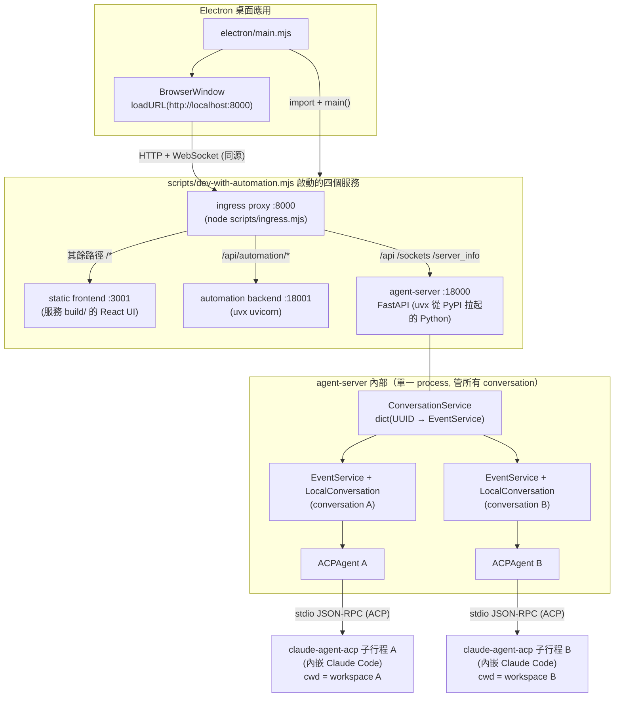
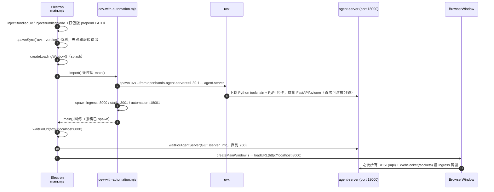
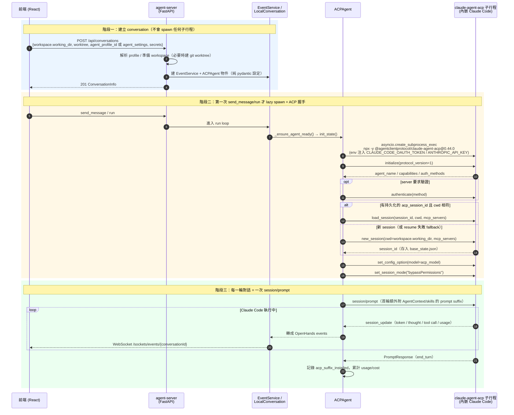
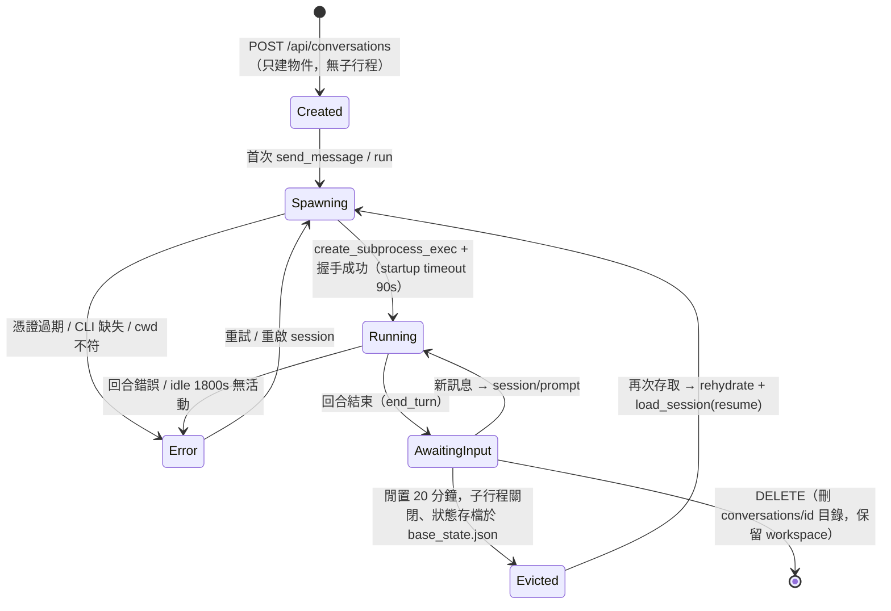
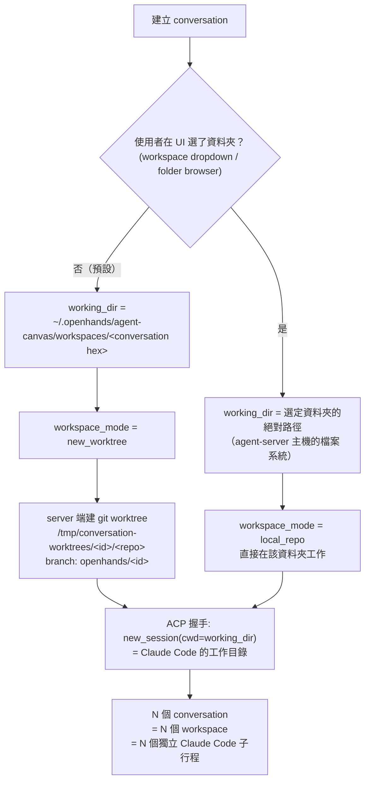
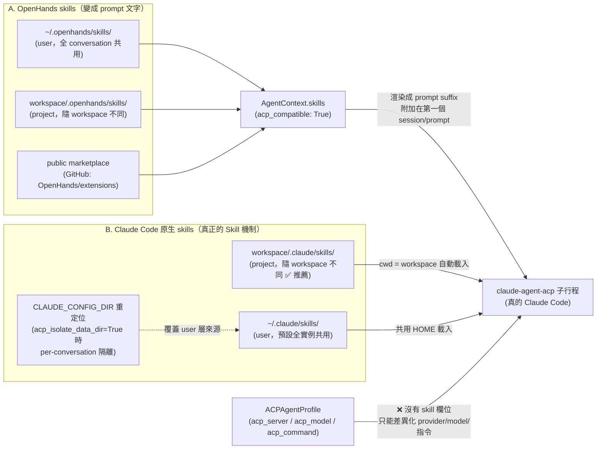

<!--
出處:使用者原創研究,2026-08-02
原始位置: ~/git/openhands/docs/research/openhands-acp-claude-code.md
研究對象: OpenHands(Agent Canvas)與 software-agent-sdk 1.39.1 本機 clone,
全部結論為開源碼行號級分析,無內部資訊,原文照收。
關鍵事實摘要與 ARCP 對照: 2026-08-jira-harness-integration.md §3.5
-->
# OpenHands × ACP × Claude Code 運作原理研究報告

> 研究日期：2026-08-02
> 研究對象：
> - `OpenHands/`（Agent Canvas 桌面應用，Electron + React）
> - `software-agent-sdk/`（openhands-sdk / openhands-agent-server，Python）
>
> 所有結論皆直接對應程式碼（附檔案路徑與行號），未做臆測。

---

## 0. 整體架構總覽



角色定位：**OpenHands 是 ACP client**，Claude Code 經 `claude-agent-acp` adapter 成為可插拔的 agent backend。同一機制也支援 Codex（`codex-acp`）與 Gemini CLI（`gemini-cli --acp`）。

---

## 1. OpenHands 是怎麼啟動的

### 1.0 啟動時序圖



### 1.1 Electron 啟動序列（`electron/main.mjs:612-677`）

1. 打包版會把 bundled 的 `uv/uvx` 與 Node bin 目錄 prepend 到 `PATH`（`injectBundledUv` / `injectBundledNode`）。
2. `spawnSync("uvx", ["--version"])` 偵測 uvx，失敗直接報錯退出。
3. 開 loading splash 視窗。
4. `startStack()`（`main.mjs:572-608`）：**不直接 spawn Python**，而是 `import()` `scripts/dev-with-automation.mjs` 並呼叫其 `main()`，由它 spawn 全部後端服務。
5. `waitForUrl("http://localhost:8000")` 等 ingress 就緒 → `waitForAgentServer("/server_info")` 等 agent-server 回 200。
6. `createMainWindow()` → `mainWin.loadURL("http://localhost:8000")`。

### 1.2 後端不是打包 binary，而是 uvx 現拉

`startAgentServer`（`scripts/dev-with-automation.mjs:775-825`）→ `buildAgentServerCommand`（`scripts/dev-safe.mjs:411-506`）產生的實際指令：

```
uvx --from openhands-agent-server==1.39.1 \
    --with openhands-sdk==1.39.1 \
    --with openhands-tools==1.39.1 \
    --with openhands-workspace==1.39.1 \
    --with "agent-client-protocol<0.11" \
    agent-server --host 127.0.0.1 --port 18000
```

- 版本號與 port（8000/18000/18001）來自 `config/defaults.json`。
- uvx 會下載 Python toolchain 並從 PyPI 安裝套件——這是首次啟動要等數分鐘的原因（ready timeout 設 10 分鐘）。
- 覆寫優先序：`OH_AGENT_SERVER_LOCAL_PATH`（本地 checkout）> `OH_AGENT_SERVER_GIT_REF` > `OH_AGENT_SERVER_VERSION` > 預設版本。
- 注入環境變數：`OH_SESSION_API_KEYS_0`（session key）、`OH_PERSISTENCE_DIR`、`OH_CONVERSATIONS_PATH`、`LOG_JSON=true` 等（`dev-safe.mjs:687-725`）。
- 關機：`before-quit` 送 `SIGTERM`，殺整個 process tree（`main.mjs:705-727`）。

### 1.3 agent-server 是什麼

- FastAPI 應用（`openhands-agent-server/openhands/agent_server/api.py:366-380`），入口 `__main__.py:210` 用 uvicorn 啟動。
- `/api/*` 全部要過 `X-Session-API-Key` header 驗證（`dependencies.py:24-37`）。
- 事件串流走**原生 WebSocket**（非 socket.io）：`/sockets/events/{conversationId}`（`sockets.py`；前端 `src/utils/websocket-url.ts:109-135`）。
- 附屬服務：VSCode server（預設開，port 8001）、VNC desktop（預設關）。

### 1.4 前端如何連線

- 桌面版 base URL = `window.location.origin` = `http://localhost:8000`（ingress 同源；`src/api/agent-server-config.ts:181-190`）。
- ingress 把 `/api`、`/sockets`、`/server_info` 等前綴轉到 agent-server :18000，`/api/automation/*` 轉 :18001，其餘給 static server :3001（`dev-with-automation.mjs:669-699`）。
- session key 由 static-server 在 serve 時注入 `window.__AGENT_CANVAS_SESSION_API_KEY__`（`agent-server-config.ts:119-132`）。

---

## 2. 何時啟動 Claude Code

### 2.0 完整時序圖：建立 conversation → lazy spawn → ACP 握手 → 對話回合



### 2.1 建立 conversation 時「還不會」啟動

前端呼叫鏈：UI → `useCreateConversation`（`src/hooks/mutation/use-create-conversation.ts:62-344`）→ `AgentServerConversationService.createConversation`（`src/api/conversation-service/agent-server-conversation-service.api.ts:369-487`）→ `POST /api/conversations`。

Payload 關鍵欄位（`src/api/agent-server-adapter.ts:940-1058`）：

- `workspace: { kind: "LocalWorkspace", working_dir: <絕對路徑> }` + `worktree: <bool>`
- `agent_profile_id` **或** 加密的 `agent_settings`（兩者互斥）；ACP 時 `agent_settings` 內含 `agent_kind: "acp"`、`acp_server: "claude-code"`、`acp_command`、`acp_model`、`mcp_config`、`agent_context`
- `secrets_encrypted`（憑證走這條，不進 profile）、`initial_message`、`max_iterations`（預設 500）等

Server 端 `_start_conversation`（`conversation_service.py:1185-1492`）只建立 `EventService` + `ACPAgent` **物件**（pydantic model，純設定），存成 `StoredConversation`。此時沒有任何子行程。

### 2.2 第一次 send_message()/run() 才 spawn（lazy）

- `LocalConversation._ensure_agent_ready()`（`local_conversation.py:1399`）→ `ACPAgent.init_state()`（`acp_agent.py:1997`）→ `_start_acp_server()`（`acp_agent.py:2532`）。
- 用 `asyncio.create_subprocess_exec`（`acp_agent.py:2657`）啟動子行程，stdin/stdout 接上 JSON-RPC（`ClientSideConnection`，並掛一個 filter 濾掉非 JSON 行）。

Claude Code 的預設啟動指令（`openhands-sdk/openhands/sdk/settings/acp_providers.py:395-425`）：

```
npx -y @agentclientprotocol/claude-agent-acp@0.44.0
```

`claude-agent-acp` 是 ACP adapter 套件（Zed 起源、現歸 `@agentclientprotocol` scope），內部用 Claude Agent SDK 包著真正的 Claude Code。agent-server 的 Docker image 會預裝 pinned binary，此時 `resolve_acp_command` 會把 `npx` 指令改寫成直接執行 `claude-agent-acp` binary。

### 2.3 子行程環境（憑證注入）

`_start_acp_server`（`acp_agent.py:2546-2595`）組 env 的優先序：`state.secret_registry` > `os.environ` > defaults。

- 憑證**不存在 profile**，由 client 經 `StartConversationRequest.secrets` 傳入，進 `secret_registry` 後整包注入子行程 env。
- claude-code 的保留憑證：`CLAUDE_CODE_OAUTH_TOKEN`（訂閱登入）或 `ANTHROPIC_API_KEY` / `ANTHROPIC_BASE_URL`；OAuth token 存在時會主動剔除後兩者（`_ENV_CONFLICT_MAP`，見 #3588）。
- 會 `env.pop("CLAUDECODE")`，避免巢狀 Claude Code 拒絕啟動（`acp_agent.py:2580`）。
- Codex/Gemini 的檔案型憑證（`auth.json` / Vertex SA JSON）由 `ACPFileSecretSpec` 宣告，materialise 到 `<conversations>/<id>/acp/<provider>/` 並設好 `CODEX_HOME` / `GOOGLE_APPLICATION_CREDENTIALS`。

### 2.4 ACP 握手流程（`acp_agent.py:2650-2911`）

1. `initialize(protocol_version=1)` → 取得 `agent_name`（用來 auto-detect provider）。
2. 需要時 `authenticate`（依 env var 自動選 method）。
3. `new_session(cwd=workspace.working_dir, mcp_servers=...)` —— **workspace 在這裡綁定**；或者 resume：`load_session(session_id)`（id 持久化在 `base_state.json` 的 `agent_state.acp_session_id`，且記錄建立時的 cwd——workspace 換了就放棄 resume 開新 session）。
4. `set_config_option(model)` 套用 `acp_model`（claude-agent-acp 0.44 用 configOptions 機制；session `_meta` 會被忽略，見 #3654）。
5. `set_session_mode("bypassPermissions")` —— 關掉 Claude Code 的權限詢問（codex 用 `agent-full-access`，gemini 用 `default` + bridge 自動核准）。

之後每一輪對話 = 一次 `session/prompt`；Claude Code 的工具呼叫、token、用量經 `session_update` 通知流回，由 `_OpenHandsACPBridge`（`acp_agent.py:1041`）轉成 OpenHands 事件推給前端。

### 2.5 其他生命週期細節

conversation（及其 Claude Code 子行程）的完整生命週期：



補充：

- **MCP 轉發**：OpenHands 設定的 MCP servers 在 `new_session`/`load_session` 時整包轉發給 Claude Code 自己去連，不是 OpenHands 代理（`_mcp_config_to_acp_servers`）。
- **timeout**：startup 90s 硬限、prompt 1800s idle 限（有活動就重置）。
- **閒置回收**：conversation 閒置 20 分鐘（`conversation_idle_ttl_seconds`）被從記憶體釋放（子行程關閉），下次存取 rehydrate + resume session（`conversation_service.py:1850-1913`）。
- **併發模型**：ACP agent 走原生 `arun()`（async，不佔 thread pool）；同步 agent 的 `run()` 才受 `max_concurrent_runs`（預設 10）的 ThreadPoolExecutor 限制（`event_service.py:1188-1198`）。

---

## 3. 可以多個 Claude Code 分不同 workspace / 不同 skill 嗎？

### 3.1 多實例、多 workspace：可以，原生設計

workspace 的決策流程（前端 `use-create-conversation.ts` + server 端 `_prepare_request_workspace`）：



- `ConversationService._event_services: dict[UUID, EventService]`（`conversation_service.py:589`）同時管多個 conversation；每個 ACP conversation 各自 spawn 一個獨立的 claude-agent-acp 子行程（`self._process`），互不干擾。
- workspace 是 **request 層級**參數（`StartConversationRequest.workspace`，必填），不是全域設定：
  - 桌面版預設：每個 conversation 一個目錄 `~/.openhands/agent-canvas/workspaces/<conversation hex>`（`buildConversationWorkingDir`，`agent-server-config.ts:203-207`），模式 `new_worktree`——server 端還會在 `/tmp/conversation-worktrees/<id>/<repo>` 建專屬 git worktree、branch `openhands/<id>`（`conversation_service.py:191-247`）。
  - 使用者也可在 UI 用資料夾瀏覽器（走 `GET /api/file/*`，瀏覽的是 agent-server 主機的檔案系統）選既有資料夾，模式變 `local_repo`，直接在該資料夾工作。
- 這個 `working_dir` 就是 `new_session(cwd=...)`，即 Claude Code 的工作目錄。**N 個 conversation = N 個 workspace = N 個獨立 Claude Code 子行程，開箱即用。**
- 隔離機制：
  - 憑證檔按 conversation 隔離在 `<conversations>/<id>/acp/<provider>/`。
  - `acp_isolate_data_dir`（`acp_agent.py:1629-1647`）可把 `CLAUDE_CONFIG_DIR` 指到 per-conversation 目錄，避免多實例搶同一份 `~/.claude` 狀態（config/快取/鎖檔，見 #1019）。桌面版預設關閉——刻意沿用本機已登入的 Claude Code 憑證與設定。

### 3.2 不同 skill：可以，但要分清楚兩套 skill 系統

兩套 skill 系統各自的來源與抵達 Claude Code 的路徑：



**(A) OpenHands 自己的 skills**（`~/.openhands/skills/`、workspace 的 `.openhands/skills/`、public marketplace）

- ACP 模式下不能變成工具——`AgentContext` 只有標記 `acp_compatible: True` 的欄位能用（`agent_context.py:451-468`），`skills` 欄位有此標記，會被渲染成 **prompt 文字**。
- 注入方式：`_render_suffix`（`acp_agent.py:2192`）渲染一次，附加在**第一個 prompt** 後面（`_build_acp_prompt`，`acp_agent.py:3149-3180`）；成功後持久化 `acp_suffix_installed=True` 避免重複注入。
- project skills 從 workspace 載入（`load_project_skills`），所以**不同 workspace 自然得到不同 OpenHands skills**。

**(B) Claude Code 原生 skills**（workspace 的 `.claude/skills/`、`CLAUDE_CONFIG_DIR` 下的 user skills）

- claude-agent-acp 跑的就是真的 Claude Code，所以每個 workspace 自己的 `.claude/` 完全生效——**這是「每個實例不同 skill」最直接乾淨的做法**。
- user 層級 skills 預設全實例共用 `~/.claude`；開 `acp_isolate_data_dir` 後每個 conversation 有獨立的 `CLAUDE_CONFIG_DIR`，理論上可差異化 user-level skills（但要自己往該目錄放東西）。

**(C) Agent profile 的能與不能**

- Profile 存在 `~/.openhands/agent-profiles/`（每個 profile 一個 JSON，`agent_profile_store.py:28`），可為不同 conversation 選不同 profile；上限 50 個。
- Discriminated union（`agent_profile.py:311-320`）：
  - `OpenHandsAgentProfile`：有 `llm_profile_ref`、`tools`、`disabled_skills`（**deny-list**，非 allow-list）、`condenser`、`mcp_server_refs` 等。
  - `ACPAgentProfile`：只有 `acp_server` / `acp_model` / `acp_session_mode` / `acp_command` / `acp_args` / `mcp_server_refs`，**沒有 skill 欄位、沒有憑證**（`agent_profile.py:209-277`）——設計哲學是「ACP server 自管工具與 prompt」。
- 所以 profile 能差異化的是 provider / model / 啟動指令 / MCP server 組合；**不能**差異化 skills。想給不同 Claude Code 實例不同 skill 組合，正解是放在各 workspace 的 `.claude/skills/`（或 `.openhands/skills/`）。
- seed 機制：store 為空時 lazy seed 一個名為 `default` 的 profile，內容從當前 `agent_settings` 反推（`seed.py:29-80`）。

### 3.3 結論

| 問題 | 答案 |
|---|---|
| 多個 Claude Code 同時跑？ | 可以。每個 conversation 一個獨立子行程，單一 agent-server 管理。 |
| 各自不同 workspace？ | 可以。workspace 是 per-conversation 參數，經 `new_session(cwd=...)` 綁定；預設就是一對話一目錄（或 git worktree）。 |
| 各自不同 skill？ | 可以。最乾淨的方式是各 workspace 的 `.claude/skills/`（Claude Code 原生）或 `.openhands/skills/`（OpenHands prompt 注入）。ACP profile 本身沒有 skill 欄位。 |

---

## 附錄：關鍵檔案索引

### OpenHands（Electron + React）

| 檔案 | 內容 |
|---|---|
| `electron/main.mjs` | Electron 主行程、啟動編排、`loadURL(:8000)` |
| `scripts/dev-with-automation.mjs` | spawn agent-server(uvx) / automation / ingress / static、路由表 |
| `scripts/dev-safe.mjs` | `buildAgentServerCommand`（uvx 指令）、env、state/workspaces 路徑 |
| `config/defaults.json` | 版本（1.39.1）、埠（8000/18000/18001） |
| `src/api/agent-server-config.ts` | base URL / session key / working dir 決策 |
| `src/hooks/mutation/use-create-conversation.ts` | 建立對話 mutation |
| `src/api/conversation-service/agent-server-conversation-service.api.ts` | `createConversation`（本地/雲） |
| `src/api/agent-server-adapter.ts` | `StartConversationRequest` payload builder、ACP agent_settings |
| `src/constants/acp-providers.ts` | ACP provider UI registry、保留憑證、憑證衝突 |
| `src/utils/acp-command.ts` | 命令列 tokenize（不經 shell，對應 server 端 `create_subprocess_exec`） |
| `src/utils/websocket-url.ts` | `/sockets/events/{id}` WS URL |
| `docs/ACP_AGENTS.md` | 官方 provider 指令表與認證說明 |

### software-agent-sdk（Python）

| 檔案 | 內容 |
|---|---|
| `openhands-sdk/openhands/sdk/agent/acp_agent.py` | **ACPAgent 核心**：spawn、握手、prompt、resume、隔離、清理 |
| `openhands-sdk/openhands/sdk/settings/acp_providers.py` | Provider registry（claude-code / codex / gemini-cli）、pinned 版本、data_dir_env_var |
| `openhands-sdk/openhands/sdk/agent/acp_file_credentials.py` | Codex auth.json 生命週期（materialise、token rotation 監看） |
| `openhands-sdk/openhands/sdk/context/agent_context.py` | `acp_compatible` 欄位標記、`to_acp_prompt_context` |
| `openhands-sdk/openhands/sdk/profiles/` | agent profile model / store / resolver / seed |
| `openhands-sdk/openhands/sdk/conversation/impl/local_conversation.py` | `_ensure_agent_ready`（lazy init 觸發點） |
| `openhands-agent-server/openhands/agent_server/api.py` | FastAPI app、lifespan、router 掛載 |
| `openhands-agent-server/openhands/agent_server/__main__.py` | uvicorn 入口、host/port 決策 |
| `openhands-agent-server/openhands/agent_server/conversation_service.py` | conversation 生命週期、worktree、profile 解析、閒置回收 |
| `openhands-agent-server/openhands/agent_server/event_service.py` | 每 conversation 的 EventService、run 執行模型 |
| `openhands-agent-server/openhands/agent_server/credential_binding.py` | 動態憑證 binding API（HTTP/local 版本化來源） |
| `examples/01_standalone_sdk/40_acp_agent_example.py` | 最小可跑的 ACPAgent + Claude Code 範例 |
